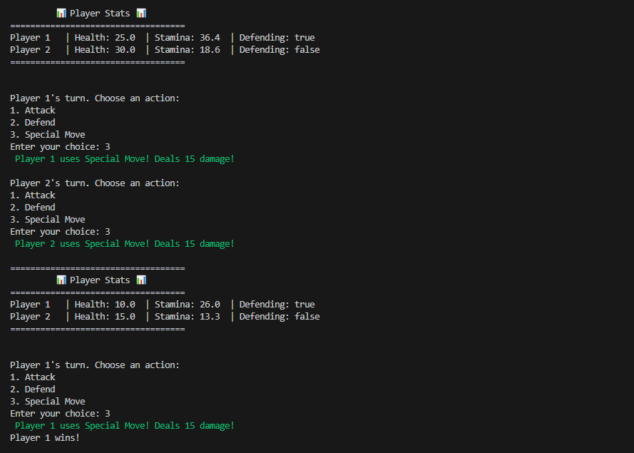

A simple turn-based strategy game built using Go. I wrote this to understand some basic workings of Golang.

## 🖼️ Screenshot

## 🚀 Features

- Attack, Defend, and Special Moves
- Simple terminal-based gameplay
- Player stats tracking
